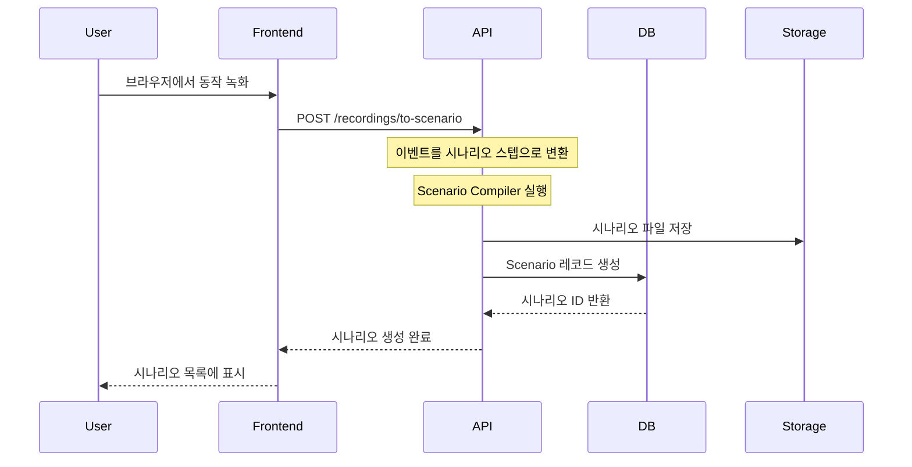
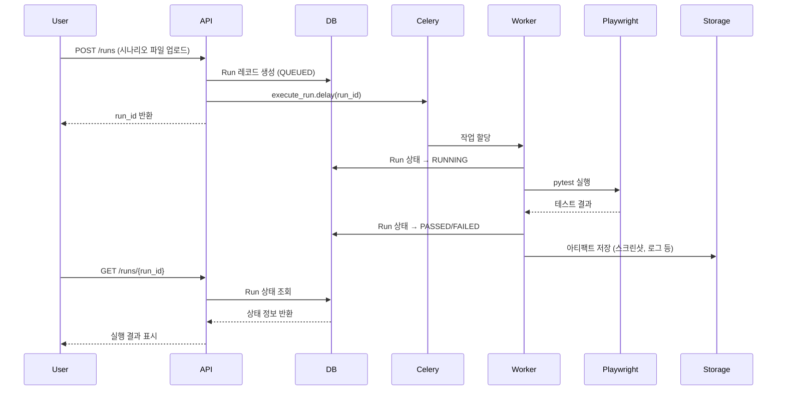
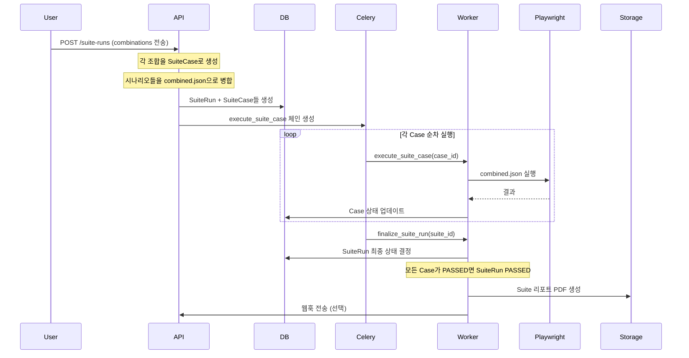
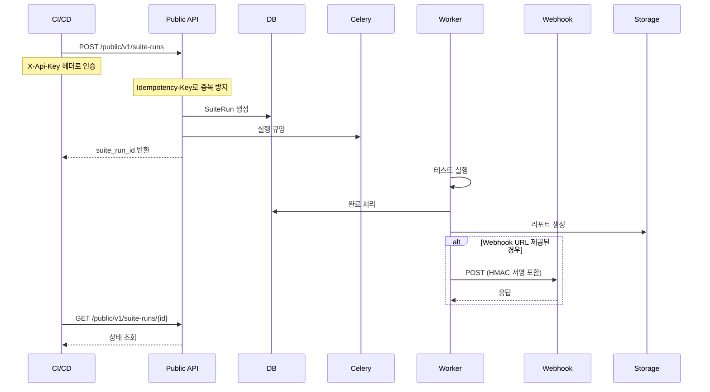
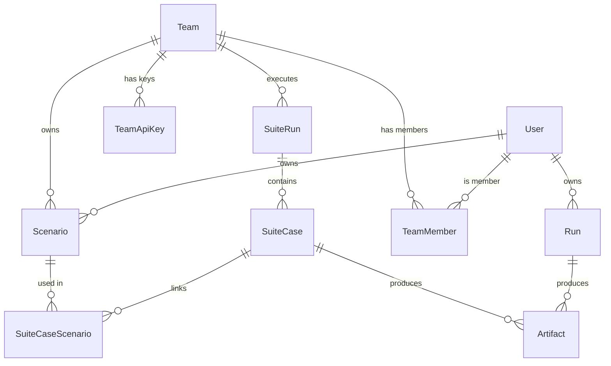

# E2E Service 발표자료

## 목차
1. [서비스 개요](#서비스-개요)
2. [아키텍처](#아키텍처)
3. [주요 Flow](#주요-flow)
4. [API 엔드포인트](#api-엔드포인트)
5. [데이터 모델](#데이터-모델)
6. [주요 기능 상세](#주요-기능-상세)

---

## 서비스 개요

### E2E Service란?
**시나리오 기반 End-to-End 테스트 자동화 서비스**

- 브라우저 기반 E2E 테스트를 시나리오 파일(YAML/JSON)로 정의하고 실행
- Playwright를 활용한 실제 브라우저 자동화
- 테스트 결과 리포트(PDF) 자동 생성
- 팀 협업 및 CI/CD 통합 지원

### 핵심 기능
- ✅ **시나리오 관리**: 개인/팀 시나리오 저장 및 공유
- ✅ **테스트 실행**: 단일 Run 및 Suite Run(조합 실행)
- ✅ **브라우저 녹화**: 크롬 확장 프로그램으로 시나리오 자동 생성
- ✅ **리포트 생성**: PDF 형식의 상세 테스트 리포트
- ✅ **CI/CD 통합**: Public API를 통한 외부 시스템 연동
- ✅ **웹훅 지원**: 테스트 완료 시 자동 콜백

---

## 아키텍처

### 기술 스택

```
┌─────────────────────────────────────────────────────────┐
│                    Frontend (React + Vite)                │
│  - 시나리오 편집기, 실행 대시보드, 리포트 뷰어           │
└────────────────────┬────────────────────────────────────┘
                     │ HTTP/REST API
┌────────────────────▼────────────────────────────────────┐
│              FastAPI Backend (Python)                    │
│  ┌──────────────┐  ┌──────────────┐  ┌──────────────┐ │
│  │   Auth API   │  │ Scenario API │  │   Run API     │ │
│  │   Teams API  │  │  Suite API   │  │  Public API   │ │
│  └──────────────┘  └──────────────┘  └──────────────┘ │
└────────────────────┬────────────────────────────────────┘
                     │
        ┌────────────┼────────────┐
        │            │            │
┌───────▼────┐ ┌─────▼─────┐ ┌───▼────────┐
│ PostgreSQL │ │  Redis    │ │  Celery     │
│  (Metadata)│ │ (Broker)   │ │  Workers    │
└────────────┘ └────────────┘ └─────────────┘
                     │
              ┌──────▼──────┐
              │  Playwright │
              │  (Browser)  │
              └─────────────┘
```

### 주요 컴포넌트

| 컴포넌트 | 역할 | 기술 |
|---------|------|------|
| **FastAPI** | REST API 서버 | Python 3.11+ |
| **PostgreSQL** | 메타데이터 저장 | SQLAlchemy ORM |
| **Redis** | Celery 메시지 브로커 | Redis 5.0+ |
| **Celery** | 비동기 작업 큐 | Celery 5.4+ |
| **Playwright** | 브라우저 자동화 | Playwright 1.48+ |
| **ReportLab** | PDF 리포트 생성 | ReportLab 4.2+ |

### 디렉터리 구조

```
artifacts/              # 테스트 실행 결과물 저장
  ├── {run_id}/         # 단일 Run 아티팩트
  └── suite/            # Suite Run 아티팩트
scenario_store/         # 시나리오 파일 저장
  ├── {user_id}/        # 개인 시나리오
  └── teams/{team_id}/  # 팀 시나리오
```

---

## 주요 Flow

### 1. 시나리오 생성 Flow



### 2. 단일 Run 실행 Flow



### 3. Suite Run 실행 Flow



### 4. CI/CD 통합 Flow



---

## API 엔드포인트

### 인증 (Auth)

| Method | Endpoint | 설명 | 인증 |
|--------|----------|------|------|
| `POST` | `/auth/register` | 회원가입 | ❌ |
| `POST` | `/auth/token` | 로그인 (JWT 발급) | ❌ |
| `GET` | `/auth/me` | 내 정보 조회 | ✅ |

**인증 방식**: OAuth2 Password Flow (Bearer JWT)

---

### 시나리오 관리 (Scenarios)

| Method | Endpoint | 설명 | 인증 |
|--------|----------|------|------|
| `POST` | `/scenarios` | 개인 시나리오 업로드 | ✅ |
| `GET` | `/scenarios/me` | 내 시나리오 목록 | ✅ |
| `GET` | `/scenarios/{id}/content` | 시나리오 내용 조회 (JSON) | ✅ |
| `PUT` | `/scenarios/{id}/content` | 시나리오 내용 수정 | ✅ |
| `POST` | `/scenarios/{id}/publish` | 팀 시나리오로 발행 | ✅ |
| `DELETE` | `/scenarios/{id}` | 시나리오 삭제 | ✅ |

**시나리오 파일 형식**:
```json
{
  "base_url": "https://example.com",
  "steps": [
    {"type": "go", "url": "/login"},
    {"type": "fill", "selector": "#email", "value": "user@example.com"},
    {"type": "click", "selector": "button[type='submit']"},
    {"type": "expect_text", "selector": ".welcome", "text": "Welcome"}
  ]
}
```

---

### 단일 Run 실행 (Runs)

| Method | Endpoint | 설명 | 인증 |
|--------|----------|------|------|
| `POST` | `/runs` | Run 생성 (시나리오 파일 업로드) | ✅ |
| `GET` | `/runs/me` | 내 Run 목록 | ✅ |
| `GET` | `/runs/{id}` | Run 상태 조회 | ✅ |
| `GET` | `/runs/{id}/artifacts` | 아티팩트 목록 | ✅ |
| `GET` | `/runs/{id}/artifacts/{name}` | 아티팩트 다운로드 | ✅ |
| `GET` | `/runs/{id}/report.pdf` | PDF 리포트 다운로드 | ✅ |
| `DELETE` | `/runs/{id}` | Run 삭제 (soft delete) | ✅ |

**Run 상태**:
- `QUEUED`: 큐에 대기 중
- `RUNNING`: 실행 중
- `PASSED`: 성공
- `FAILED`: 실패

---

### Suite Run 실행 (Suite Runs)

| Method | Endpoint | 설명 | 인증 |
|--------|----------|------|------|
| `POST` | `/suite-runs` | Suite Run 생성 | ✅ |
| `GET` | `/suite-runs/me` | 내 Suite Run 목록 | ✅ |
| `GET` | `/suite-runs/{id}` | Suite Run 상태 조회 | ✅ |
| `GET` | `/suite-runs/{id}/cases` | Case 목록 조회 | ✅ |
| `GET` | `/suite-runs/{id}/report.pdf` | Suite 리포트 PDF | ✅ |
| `DELETE` | `/suite-runs/{id}` | Suite Run 삭제 | ✅ |

**Suite Run 개념**:
- 사용자가 정의한 **조합(combinations)** 실행
- 예: `[[scenario1, scenario2], [scenario3, scenario4]]`
- 각 조합은 **SuiteCase**로 변환되어 순차 실행
- 모든 Case가 PASSED일 때만 SuiteRun이 PASSED

---

### 팀 관리 (Teams)

| Method | Endpoint | 설명 | 인증 | 권한 |
|--------|----------|------|------|------|
| `POST` | `/teams` | 팀 생성 | ✅ | - |
| `GET` | `/teams/me` | 내 팀 목록 | ✅ | - |
| `GET` | `/teams/{id}/members` | 팀 멤버 목록 | ✅ | MEMBER+ |
| `POST` | `/teams/{id}/members` | 멤버 추가 | ✅ | OWNER |
| `GET` | `/teams/{id}/scenarios` | 팀 시나리오 목록 | ✅ | MEMBER+ |
| `PATCH` | `/teams/{id}/scenarios/{sid}` | 팀 시나리오 이름 수정 | ✅ | OWNER |
| `PUT` | `/teams/{id}/scenarios/{sid}/file` | 팀 시나리오 파일 교체 | ✅ | OWNER |
| `DELETE` | `/teams/{id}/scenarios/{sid}` | 팀 시나리오 삭제 | ✅ | OWNER |

**팀 역할**:
- `OWNER`: 모든 권한 (멤버 관리, 시나리오 수정/삭제, API Key 발급)
- `ADMIN`: Suite Run 실행, 시나리오 조회
- `MEMBER`: 시나리오 조회만

---

### 브라우저 녹화 (Recordings)

| Method | Endpoint | 설명 | 인증 |
|--------|----------|------|------|
| `POST` | `/recordings/to-scenario` | 녹화 이벤트 → 시나리오 변환 | ✅ |

**지원 이벤트 타입**:
- `navigate`: 페이지 이동
- `click`: 클릭
- `fill`: 입력
- `assert_text`: 텍스트 검증
- `assert_visible`: 요소 존재 검증
- `assert_url`: URL 검증

---

### Draft 관리 (Drafts)

| Method | Endpoint | 설명 | 인증 |
|--------|----------|------|------|
| `GET` | `/drafts` | Draft 목록 | ✅ |
| `POST` | `/drafts` | Draft 저장 | ✅ |
| `DELETE` | `/drafts/{id}` | Draft 삭제 | ✅ |

**용도**: Suite Run 실행 전 조합을 임시 저장

---

### Public API (CI/CD 통합)

| Method | Endpoint | 설명 | 인증 |
|--------|----------|------|------|
| `POST` | `/public/v1/suite-runs` | Suite Run 실행 요청 | API Key |
| `GET` | `/public/v1/suite-runs/{id}` | Suite Run 상태 조회 | API Key |
| `GET` | `/public/v1/suite-runs/{id}/report.pdf` | 리포트 다운로드 | API Key |

**인증 방식**: `X-Api-Key` 헤더
- 형식: `dubbi_sk_{prefix}_{secret}`
- 팀 OWNER만 발급 가능

**특징**:
- **Idempotency**: `Idempotency-Key` 헤더로 중복 실행 방지
- **Webhook**: 완료 시 자동 콜백 (HMAC 서명 지원)
- **Context**: CI/CD 메타데이터 저장 (git_sha, build_id 등)

---

### 팀 통합 관리 (Team Integrations)

| Method | Endpoint | 설명 | 인증 | 권한 |
|--------|----------|------|------|------|
| `GET` | `/teams/{id}/api-keys` | API Key 목록 | ✅ | OWNER |
| `POST` | `/teams/{id}/api-keys` | API Key 발급 | ✅ | OWNER |
| `DELETE` | `/teams/{id}/api-keys/{key_id}` | API Key 폐기 | ✅ | OWNER |
| `GET` | `/teams/{id}/integrations/external-requests` | 외부 요청 로그 | ✅ | OWNER |
| `GET` | `/teams/{id}/integrations/webhook-deliveries` | 웹훅 전송 로그 | ✅ | OWNER |

---

## 데이터 모델

### 핵심 엔티티 관계도



### 주요 테이블

#### Users
- `id`: UUID
- `email`: 이메일 (unique)
- `password_hash`: bcrypt 해시
- `is_active`: 활성화 여부

#### Teams
- `id`: UUID
- `name`: 팀 이름 (unique)

#### TeamMembers
- `team_id`: 팀 ID
- `user_id`: 사용자 ID
- `role`: OWNER/ADMIN/MEMBER

#### Scenarios
- `id`: UUID
- `name`: 시나리오 이름
- `owner_user_id`: 개인 소유자 (nullable)
- `owner_team_id`: 팀 소유자 (nullable)
- `scenario_path`: 파일 경로

#### Runs
- `id`: UUID
- `status`: QUEUED/RUNNING/PASSED/FAILED
- `owner_user_id`: 소유자
- `scenario_path`: 실행한 시나리오 경로
- `artifact_dir`: 아티팩트 디렉터리
- `created_at`, `started_at`, `finished_at`: 시간 정보
- `exit_code`: 종료 코드
- `error_message`: 에러 메시지
- `is_deleted`: soft delete 플래그

#### SuiteRuns
- `id`: UUID
- `requested_by_user_id`: 요청자
- `team_id`: 팀 스코프 (nullable)
- `status`: QUEUED/RUNNING/PASSED/FAILED
- `submitted_combinations_json`: 제출된 조합
- `artifact_dir`: 아티팩트 디렉터리
- `trigger_api_key_id`: Public API로 실행된 경우
- `external_idempotency_key`: 중복 방지 키
- `webhook_url`: 웹훅 URL
- `webhook_secret`: HMAC 서명 secret

#### SuiteCases
- `id`: UUID
- `suite_run_id`: 소속 Suite Run
- `case_index`: 케이스 순서
- `status`: QUEUED/RUNNING/PASSED/FAILED
- `combined_scenario_path`: 병합된 시나리오 파일
- `artifact_dir`: 케이스별 아티팩트

#### TeamApiKeys
- `id`: UUID
- `team_id`: 팀 ID
- `name`: 키 이름
- `prefix`: 토큰 prefix (16자)
- `secret_hash`: SHA256 해시
- `revoked_at`: 폐기 시각

---

## 주요 기능 상세

### 1. 시나리오 컴파일러 (Scenario Compiler)

**목적**: 녹화된 이벤트를 실행 가능한 시나리오로 변환

**처리 과정**:
1. **Selector 후보군 생성**: 여러 locator 전략 생성
   - CSS Selector
   - XPath
   - Text-based locator
   - Role-based locator (Playwright)

2. **Wait 자동 삽입**: 동적 콘텐츠 대응
   - 네트워크 대기
   - 요소 로딩 대기
   - 애니메이션 완료 대기

3. **텍스트 기반 locator 추가**: 안정성 향상
   - `get_by_text()`, `get_by_label()` 등

**예시**:
```json
// 입력 (녹화 이벤트)
{
  "type": "click",
  "selector": "#submit-btn"
}

// 출력 (컴파일된 시나리오)
{
  "type": "click",
  "selector": "#submit-btn",
  "locators": [
    {"strategy": "css", "value": "#submit-btn"},
    {"strategy": "text", "value": "Submit"},
    {"strategy": "role", "value": "button", "name": "Submit"}
  ],
  "wait": {
    "network_idle": true,
    "timeout": 5000
  }
}
```

---

### 2. Suite Run 조합 실행

**개념**:
- 사용자가 여러 시나리오를 **조합**하여 실행
- 예: `[[login, checkout], [login, search, add_to_cart]]`

**실행 방식 (순차 실행)**:
1. 각 조합을 **SuiteCase**로 변환
2. Case 내 시나리오들의 **steps를 병합**하여 `combined.json` 생성
3. 동일 브라우저 세션에서 순차 실행
4. 모든 Case가 PASSED일 때만 SuiteRun PASSED

**장점**:
- 로그인 상태 유지 (세션 공유)
- 빠른 실행 (브라우저 재시작 최소화)

---

### 3. 리포트 생성

#### 단일 Run 리포트
- **포함 내용**:
  - 실행 메타데이터 (시간, 상태, exit_code)
  - 시나리오 스텝 목록
  - 스크린샷 (각 스텝별)
  - 에러 메시지 (실패 시)
  - 디버그 로그 (선택)

#### Suite Run 리포트
- **포함 내용**:
  - Suite 실행 요약
  - 각 Case별 결과
  - Case별 리포트 링크
  - 통계 (passed/failed count)

**생성 시점**:
- 단일 Run: 요청 시 생성 (캐시 가능)
- Suite Run: `finalize_suite_run` 시 자동 생성

---

### 4. 웹훅 전송

**트리거**: Suite Run 완료 시

**전송 정보**:
```json
{
  "suite_run_id": "uuid",
  "status": "PASSED|FAILED",
  "created_at": "ISO8601",
  "finished_at": "ISO8601",
  "case_count": 3,
  "passed_cases": 2,
  "failed_cases": 1,
  "report_url": "https://.../report.pdf",
  "context": {
    "git_sha": "...",
    "build_id": "..."
  }
}
```

**보안**:
- HMAC-SHA256 서명 지원
- `X-Dubbi-Signature` 헤더로 검증 가능

**재시도**: 최대 3회 (지수 백오프)

---

### 5. 아티팩트 관리

**저장 위치**:
```
artifacts/
  ├── {run_id}/              # 단일 Run
  │   ├── scenario.yaml      # 업로드된 시나리오
  │   ├── step_*.png          # 스크린샷
  │   ├── step_log.jsonl      # 스텝 로그
  │   ├── pytest.stdout.log  # pytest 출력
  │   ├── report.pdf          # 리포트
  │   └── allure-results/     # Allure 결과
  └── suite/
      └── {suite_id}/
          ├── case_001_{id}/
          ├── case_002_{id}/
          └── suite_report.pdf
```

**삭제 처리**:
- Soft delete: `is_deleted = true`
- 아티팩트 이동: `_pending_delete/{id}_{timestamp}/`
- 실제 삭제는 별도 배치 작업 (구현 예정)

---

### 6. 보안 기능

#### 인증
- **JWT 토큰**: HS256 알고리즘
- **토큰 만료**: 24시간 (설정 가능)
- **비밀번호 정책**:
  - 최소 12자
  - 영문 + 숫자 포함
  - 최대 128자

#### 권한 관리
- **개인 리소스**: 소유자만 접근
- **팀 리소스**: 팀 멤버만 접근 (역할별 권한)
- **Public API**: API Key 기반 인증

#### SSRF 방지
- `BASE_URL_ALLOWLIST`: 허용된 도메인만 접근 가능 (선택)

---

## 실행 환경

### Docker Compose 구성

```yaml
services:
  api:          # FastAPI 서버
  worker:       # Celery Worker
  db:           # PostgreSQL
  redis:        # Redis (Celery Broker)
```

### 환경 변수

| 변수 | 설명 | 기본값 |
|------|------|--------|
| `DATABASE_URL` | PostgreSQL 연결 문자열 | `postgresql+psycopg://...` |
| `REDIS_URL` | Redis 연결 문자열 | `redis://redis:6379/0` |
| `ARTIFACT_ROOT` | 아티팩트 저장 경로 | `./artifacts` |
| `SCENARIO_ROOT` | 시나리오 저장 경로 | `./scenario_store` |
| `JWT_SECRET_KEY` | JWT 서명 키 | `CHANGE_ME` |
| `PUBLIC_BASE_URL` | Public API 기본 URL | `http://localhost:8000` |

---

## 요약

### 핵심 가치
1. **쉬운 시나리오 작성**: 브라우저 녹화로 자동 생성
2. **유연한 실행**: 단일/조합 실행 모두 지원
3. **상세한 리포트**: PDF 형식의 실행 결과
4. **CI/CD 통합**: Public API로 외부 시스템 연동
5. **팀 협업**: 팀 단위 시나리오 공유 및 실행

### 주요 특징
- ✅ 비동기 실행 (Celery)
- ✅ 확장 가능한 아키텍처
- ✅ 상세한 로깅 및 아티팩트 저장
- ✅ 웹훅을 통한 이벤트 알림
- ✅ Idempotency 지원 (중복 실행 방지)

---

## Q&A

**Q: 시나리오 파일 형식은?**
A: YAML 또는 JSON 형식 지원. JSON은 UI 편집기에서 직접 수정 가능.

**Q: Suite Run에서 시나리오 조합은 어떻게 실행되나요?**
A: 각 조합의 시나리오 steps를 하나로 병합하여 동일 브라우저 세션에서 순차 실행합니다.

**Q: Public API 인증은 어떻게 하나요?**
A: 팀 OWNER가 발급한 API Key를 `X-Api-Key` 헤더에 포함하여 요청합니다.

**Q: 웹훅 서명 검증은 어떻게 하나요?**
A: `X-Dubbi-Signature` 헤더에 HMAC-SHA256 서명이 포함됩니다. `webhook_secret`으로 검증 가능합니다.

---

**문서 버전**: 1.0  
**최종 업데이트**: 2024

